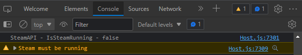

## Steam Interop Example for DIRECT 7.2

The steam interop example shows how to get information from the Steamworks API. It retrieves information such as whether or not the user is logged on, what their steam ID is, and what their session token is. The Javascript classes provided mirror the classes that the Steamworks API provides.

> **Note**
> Please use the branch corresponding to your version of DIRECT.

### Contents

* steamworks - Steamworks libraries and headers
* js - Javascript classes
* interop - DIRECT interop headers
* mac - macOS specific files
* linux - Linux specific files
* windows - Windows specific files

### Requirements

* CMake 3.15

### Build Instructions

Fetch submodules using Git:

```bash
git submodule update --init
```

CMake is a makefile generator that produces solutions and project files for various compiler toolkits. To generate the solution files for your environment and to build the project:

```bash
cmake -S . -B build
cmake --build build --config Debug
```

The target architecture of the shared library must match the architecture of the DIRECT client you are using. For example, if you are using host.exe for 32-bit Windows, then you must configure for x86 by using CMake argument -A Win32. If configuring on Windows, it is recommended that you statically link against MSVC runtime using `-D CMAKE_MSVC_RUNTIME_LIBRARY=MultiThreaded` to prevent the user from having to install the Visual C++ runtime separately. To build on macOS, using Xcode, supply the `-G Xcode` argument.

### Setup Instructions

First copy the interop the SteamWorks shared libraries to the directory where you intended to load it from. For our example, we use the same directory as the client's executable: `{moduleAppDirectory}`

### JavaScript Integration

If you intend to use the interop with-in JavaScript use the following steps:

1. Copy all of the javascript source files from the `js` directory to a directory in your skin called `src/interop`.
2. Load the example code and interop in `/src/App.jsx` using `app.loadInterop`:
    ```js
    import "./interop/SteamExample.js";

    const steamPath = app.expandString("{moduleAppDirectory}{libraryPrefix}steam.{libraryExtension}");
    app.loadInterop("steam", steamPath);
    ```
3. Call `app.unloadInterop` before `skinWindow.close()` in `src/App.jsx`:
    ```js
    app.unloadInterop("steam", steamPath);
    ``` 
4. Modify app.yaml and set `cef.enabled: true`
5. Add the following React component to your React app which will draw the friends list in a canvas element:
    ```html
    import FriendsList from "../interop/FriendsList.jsx";
    <FriendsList/>
    ```
6. Run `host` application with `--devtools --disablesecurity` (during production if you sign the dll you won't need this).
7. If it integrated properly, you will see the following lines in console window. <br/><br/>And you will see the Steam friends list populated. <br/> <br/>If you do not have steam running you will see a warning in the console window. <br/>
