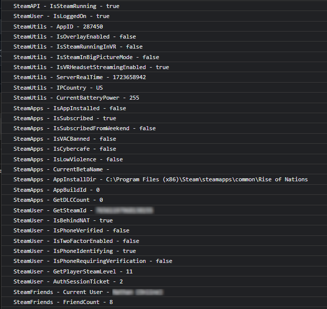

## Steam Interop Example for DIRECT 6.1

The steam interop example shows how to get information from the Steamworks API. It retrieves information such as whether or not the user is logged on, what their steam ID is, and what their session token is. The Javascript classes provided mirror the classes that the Steamworks API provides.

### Contents

* bin - Steam shared libraries
* steamworks - Steamworks headers
* js - Javascript classes
* interop - DIRECT interop headers
* mac - macOS specific files
* linux - Linux specific files
* windows - Windows specific files

### Requirements

* CMake 2.8

### Build Instructions

CMake is a makefile generator that produces solutions and project files for various compiler toolkits.

#### Visual Studio

```
cmake -S . -B build -A Win32 -D CMAKE_MSVC_RUNTIME_LIBRARY=MultiThreaded
cmake --build build --config Debug
```

#### Xcode

```
cmake -S . -B build -G Xcode
cmake --build build --config Debug
```

#### Unix Makefiles

```
cmake -S . -B build -D CMAKE_BUILD_TYPE=Debug
cmake --build build
```

### Setup Instructions

1. Compile the solution or project for your platform.
2. Copy the dynamic library from the target directory to the host.exe directory.
3. Copy the SteamWorks shared libraries _steam_api.dll_ to the host.exe directory.
4. Edit workflow.json and add the following task to be run in the load entry point:
    ```
    "loadSteam": {
        "type": "interopLoad",
        "name": "steam",
        "path": "{ModuleDirectory}{LibraryPrefix}steam.{LibraryExtension}"
    },
    ```
5. Edit workflow.json and add the following task to be run in the unload entry point:
    ```
    "unloadSteam": {
        "type": "interopUnload",
        "name": "steam",
        "path": "{ModuleDirectory}{LibraryPrefix}steam.{LibraryExtension}"
    },
    ```
6. Copy the files from the js directory to the skin directory
7. Open main.html and insert the following scripts after main.js:
    ```html
    <script src="steamapi.js" type="text/javascript"></script>
    <script src="steamapps.js" type="text/javascript"></script>
    <script src="steamfriends.js" type="text/javascript"></script>
    <script src="steamuser.js" type="text/javascript"></script>
    <script src="steamuserstats.js" type="text/javascript"></script>
    <script src="steamutils.js" type="text/javascript"></script>
    <script src="steamtest.js" type="text/javascript"></script>
    ```
8. Add the following html element which will display the friends list:
    ```html
    <canvas width="300" height="600" id="friendsList"/>
    ```
9. Modify app.json to set `cefEnabled` to `true`
10. Modify main.json to set `enableDeveloperTools` to `true` for cef
11. Run host.exe with `--disablesecurity` as the first argument (during production if you sign the dll you won't need this).

### Screenshots

In the dev tools you can see the information being retrieved from the Steam client using the Steamworks API. The source code that prints all the details to the console can be found in _steamtest.js_.



If a canvas element with an id of `friendsList` is present in the html it will draw the avatars for all the friends.


